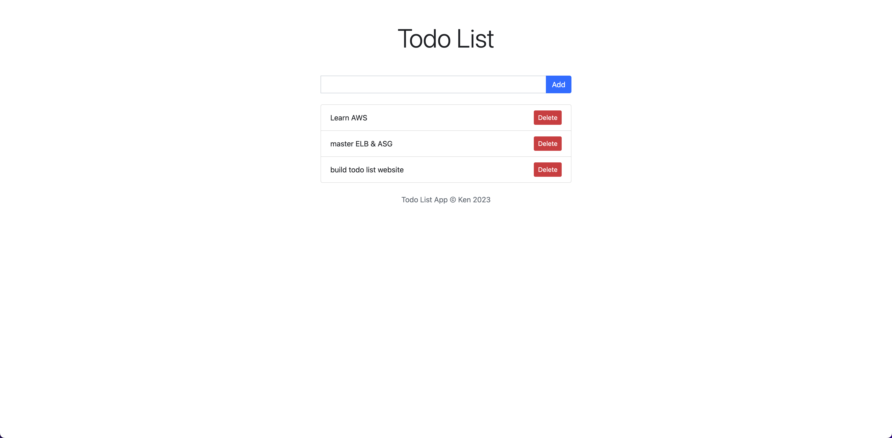

# Todo List
This is a simple Todo List web application built with Flask, SQLAlchemy, and Jinja2 templates.

## Requirements
- Python 3.x
- Flask
- SQLAlchemy

## Installation
1. Clone the repository to your local machine:
```
$ git clone https://github.com/yourusername/todo-list.git
```
2. Change into the project directory:
```
$ cd todo-list
```
3. Install the required Python packages:
```
$ pip install -r requirements.txt
```
4. Create a new database by running the following command:
```
$ python create_db.py
```
5. Start the Flask development server:
```
$ python app.py
```
Open a web browser and go to `http://localhost:5000` to view the Todo List application.

### Here is the UI:

